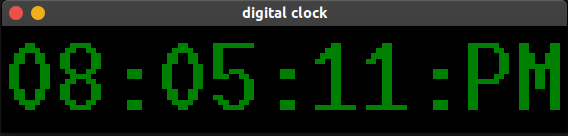

# Digital-Clock-Using-Tkinter

Python ***Tkinter*** can be used to create all kinds of GUI programs for the web and desktop.

Here I create a digital clock which work with your machine's real time, and give a nice view time.

